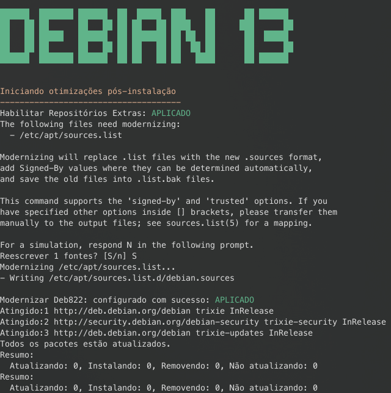

# Debian 13 – Script de Pós-Instalação e Otimizações

Script de pós-instalação para Debian 13, focado em desktops e laptops, com objetivo de melhorar desempenho, tempo de boot, uso de SSD, consumo de energia e organização do sistema, mantendo segurança e reversibilidade.


## Imagem



## 📌 Objetivos

- Habilitar repositórios contrib e non-free
- Modernizar fontes APT para o formato Deb822
- Ativar ZRAM para melhor uso de memória cache
- Otimizar CPU frequency scaling - modo desempenho
- Ajustar fstab para o uso de SSDs
- Reduzir tamanho do initramfs
- Otimizar o tempo de boot no GRUB
- Limitar tamanho dos registros logs do journald
- Aplicar ajustes de sysctl voltados a desktop

## 🔹  O que o script faz

### Repositórios Extras - `/etc/apt/`

Habilita os repositórios contrib e non-free para ter acesso a 
mais pacotes de software.

Habilita o novo formato deb822 é uma maneira mais moderna e organizada 
de gerenciar os repositórios de software. 

- Habilita os repositórios `contrib` e `non-free`
- Migra o APT para o formato **Deb822**
- Considere editar o arquivo para mudar a nacionalidade dos servidores
- Saiba mais em https://wiki.debian.org/SourcesList


### ZRAM - `/etc/systemd/zram-generator.conf`

Habilita o ZRAM oferece benefícios significativos, principalmente por 
criar um dispositivo de troca (swap) comprimido na memória RAM, o que 
melhora o desempenho do sistema ao reduzir drasticamente a necessidade 
de usar o disco rígido ou SSD como swap.

```text
[zram0]
zram-size = 4096 #4G
compression-algorithm = zstd
```

- Instala `systemd-zram-generator`
- Evita o uso de swap em disco
- Melhora responsividade em sistemas com pouca RAM
- Considere editar o arquivo e ajustar o _zram-size_ ao perfil do seu hardware
- Considere trocar o algoritimo de compressão em processadores fracos
- Saiba mais em https://wiki.debian.org/ZRam

### CPU Frequency Scaling - `/etc/systemd/system/cpupower.service`

Habilita o Serviço systemd para forçar o governor "performance" em todos os 
núcleos da CPU indicado para desktops e notebooks ligados à tomada, onde 
desempenho é prioridade em relação à economia de energia.

```text
[Unit]
Description=Set all cores to performance governor
After=multi-user.target

[Service]
Type=oneshot
ExecStart=/usr/bin/cpupower -c all frequency-set -g performance

[Install]
WantedBy=multi-user.target
```

- Habilita controle moderno de frequência da CPU
- Usa `linux-cpupower` com serviço
- Você deve editar o arquivo para melhor adquar ao perfil do seu hardware
- saiba mais em https://wiki.debian.org/CpuFrequencyScaling
- Outro otimo post em https://www.vivaolinux.com.br/dica/Regulando-velocidade-e-energia-gasta-pelos-processadores-Metodo-moderno-cpupower

### FSTAB otimização de SSD / NVMe - `/etc/fstab`

A remoção da opção de montagem com discard e a habilitação do fstrim.timer, 
é prática comum em muitas distribuições Linux modernas, deve-se principalmente 
a melhorias de desempenho e longevidade do SSD.

Quando a opção de montagem discard está habilitada, é realizado o TRIM 
contínuo (em tempo real). Isso significa que, cada vez que um bloco de 
dados é excluído, um comando TRIM é imediatamente enviado ao SSD.

O fstrim.timer utiliza uma abordagem de TRIM periódico, que é executado em 
intervalos programados (geralmente uma vez por semana, por padrão no Debian).

- Remove `discard` do fstab
- Ativa `fstrim.timer` periódico semanalmente
- `Cuidado!` esse script foi idealizado para uso SSD/NVMe com partições _ext4_
- Saiba mais em https://wiki.debian.org/SSDOptimization
- Outra ótima documentação em https://docs.voidlinux.org/config/ssd.html


### Sincronização de horário -`/etc/systemd/timesyncd.conf`

Sincronização com a Hora Legal: O NTP.br fornece acesso à Hora Legal 
Brasileira (HLB), que é a referência oficial de tempo no Brasil, sendo 
uma fonte confiável para seus dispositivos.

```text
[Time]
NTP=a.st1.ntp.br b.st1.ntp.br c.st1.ntp.br d.st1.ntp.br
```

- Compatível com _NTP.br_ orgão competente do Brasil
- Aplique somente se você deseja usar servidores nacionais
- Saiba mais em https://ntp.br/guia/linux/d


### Initramfs - `/etc/initramfs-tools/initramfs.conf`

Diminuir o tamanho do Initramfs é benéfico principalmente para
economizar espaço na partição /boot e, em sistemas embarcados ou com recursos 
limitados, reduzir o tempo de inicialização e o uso de RAM.


```text
MODULES=dep
COMPRESS=zstd
COMPRESSLEVEL=19
```

- Reduz tamanho do `initrd`
- Configura o modo _dep_ que tenta carregar os módulos necessários conforme sua máquina
- Ativa compressão com `zstd`
- Saiba mais em https://wiki.debian.org/initramfs


## GRUB - `/etc/default/grub`

Configurar o GRUB para proporcionar um "boot rápido" visualmente, suprimindo a maioria 
das mensagens do kernel durante a inicialização. Isso cria uma experiência de inicialização 
mais limpa e silenciosa.

```bash
GRUB_TIMEOUT=1
GRUB_TIMEOUT_STYLE=hidden
GRUB_CMDLINE_LINUX_DEFAULT="quiet loglevel=3 systemd.show_status=auto rd.udev.log_level=3"
GRUB_TERMINAL=console
GRUB_DISABLE_OS_PROBER=true
```

- 1 segundo boot praticamente imediato e ainda permite _Esc_ ift se precisar
- Logs ainda suficientes para debug básico
- Mensagens na tela apenas se algo atrasar
- A opção _console_ Mantém o boot simples
- O _OS_Prober_ está desativado pois a instalacao é a única no disco.
- Saiba mais em [Grub Simple-configuration](https://www.gnu.org/software/grub/manual/grub/grub.html#Simple-configuration)

### Journald - `/etc/systemd/journald.conf`

O journald diminui o tamanho dos arquivos de log automaticamente através de políticas 
de rotação e limite de espaço em disco, que são configuradas para evitar que os logs 
consumam demasiado espaço disponível no sistema. O script ajusta do armazemaneto de logs 
apropiado para uso desktop.

```text
SystemMaxUse=200M
SystemMaxFileSize=50M
MaxRetentionSec=1month
```

- Excelente para desktop
- Limita o total de logs persistentes
- Evita desgaste de SSD
- Facilita limpeza automática
- Garante que logs antigos não sobrevivam indefinidamente
- Saiba mais em https://wiki.archlinux.org/title/Systemd/Journal


### Ajustes de kernel (sysctl) - `/etc/sysctl.d/99-custom.conf` 

O kernel padrão do Linux é projetado para ser um sistema equilibrado e estável 
para uso geral, mas nem sempre é otimizado para todos os cenários de uso.

A realização de ajustes do kernel (via sysctl) em qualquer sistema Linux, possibilita 
a otimização de desempenho, segurança e personalização do comportamento do sistema operacional
para atender a necessidades específicas. 

```text
vm.swappiness = 10
vm.vfs_cache_pressure = 50
vm.dirty_background_ratio = 5
vm.dirty_ratio = 15
fs.inotify.max_user_watches = 524288
```

- Aplica ajustes comuns voltados para desktop
- Reduz micro travamentos
- Melhora a responsividade
- Saiba mais em https://wiki.archlinux.org/title/Sysctl


### Desativar o serviço `NetworkManager-wait-online.service`

O principal motivo para desabilitar o NetworkManager-wait-online.service é reduzir 
o tempo de inicialização do sistema, especialmente em desktops, notebooks ou máquinas 
virtuais que não dependem de recursos de rede para concluir o processo de boot. 

- Otimiza o tempo de boot para Desktop comum
- `Cuidado!` serviços como VPN e outros de rede no boot podem quebrar


## ⚙️ Requisitos

- Debian 13 (Trixie)
- Sistema desktop minimo
- Acesso root (ou sudo)
- Partições ext4 (para otimização de SSD)


## ⚠️ Avisos importantes

Este repositório é destinado a **desktops pessoais** e foi validado em uma **instalação limpa do Debian 13**. Seu propósito é servir como referência de estudo e exemplo prático de configurações recomendadas.

As alterações aplicadas buscam manter-se o mais próximo possível do padrão da instalação, adotando apenas ajustes amplamente documentados e recomendados. Para melhores resultados, revise os arquivos em `configs` e personalize-os de acordo com seu hardware e cenário de uso.

- O script modifica arquivos críticos do sistema
- Backups automáticos são criados em suas respectivas pastas antes de cada alteração `<arquivo>.bak`
- A desativação do **wait-online** é indicada apenas para desktop
- O arquivo de log `debian-postinstall.log` é gerado no final

## ▶️ Como usar

```bash
git clone git@github.com:bsoliveira/debian13-postinstall.git
cd debian13-postinstall
chmod +x debian-postinstall.sh
./debian-postinstall.sh
```

## Testes recomendados após a execução

```bash
mount | grep ext4
lsblk --discard
swapon --show
systemctl status fstrim.timer
systemctl status cpupower.service
cpupower frequency-info
timedatectl status
```

## Resultados do `systemd-analyze`

Antes:
```bash
Startup finished in 1.991s (kernel) + 5.003s (userspace) = 6.995s
graphical.target reached after 5.003s in userspace.
```

Depois:
```bash
Startup finished in 983ms (kernel) + 2.077s (userspace) = 3.061s
graphical.target reached after 2.076s in userspace.
```

## 🔄 Informações úteis de como reverter

Restaurar arquivos .bak criados em:

- /etc/apt/sources.list-original.bak
- /etc/initramfs-tools/initramfs.conf.bak
- /etc/default/grub.bak
- /etc/fstab.bak
- /etc/systemd/journald.conf.bak
- /etc/systemd/timesyncd.conf.bak


Remover arquivos .conf criados em:

- /etc/apt/sources.list.d/debian.sources
- /etc/systemd/zram-generator.conf
- /etc/sysctl.d/99-custom.conf 
- /etc/systemd/system/cpupower.service


Remover zram-generator
- sudo swapoff -a
- sudo apt purge systemd-zram-generator

Remover cpupower
- sudo systemctl stop cpupower.service
- sudo systemctl disable cpupower.service
- sudo apt purge linux-cpupower


Ativar/Desativar serviços:

- sudo systemctl disable fstrim.timer
- sudo systemctl enable NetworkManager-wait-online.service 


Reiniciar serviços:

- sudo systemctl restart systemd-journald
- sudo systemctl restart systemd-timesyncd


Depois reexecutar:

```bash
sudo update-grub
sudo update-initramfs -u
sudo systemctl daemon-reload
sudo apt autoremove
```


## 📣 Disclaimer

Este script é fornecido “como está”, sem garantias.
Use por sua conta e risco.
